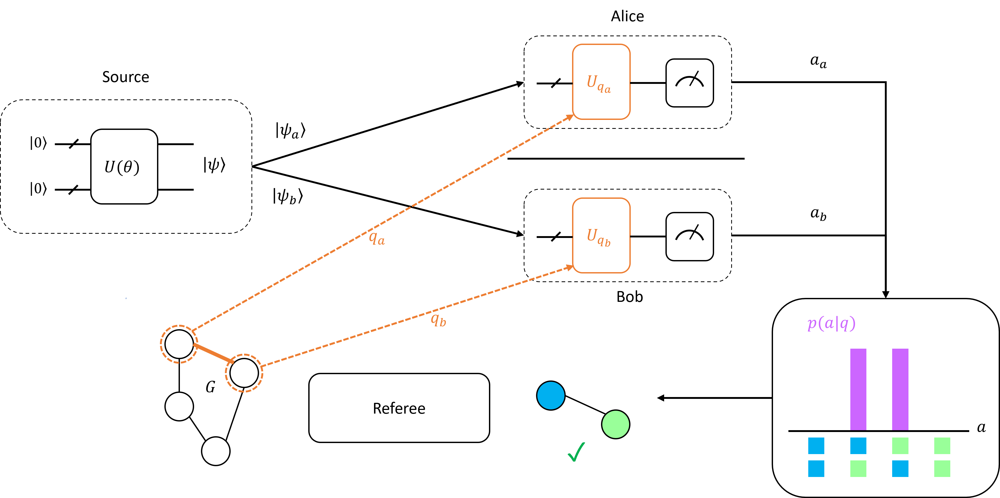

# Non-Local Games



Code for _Variational Methods for Computing Non-Local Quantum Strategies_ ([arXiv:TBD](target:_blank)).

### Examples

The `examples/` folder contains different scripts that use the nonlocal games library.

- `dpo/`: Script for executing multiple trials of DPO on the NPS game in parallel
- `g14/`: Program that runs multiple trials of DPO on G14 in parallel
- `g14_on_ibm/`: Dispatches a strategy for G14 onto multiple IBM quantum devices. See this if you're interested in loading the G14 circuit. Also contains examples for zero-noise extrapolation (ZNE), but this is not in the paper.

### Data

Look at `data/metadata.md` for details.

### Installation

You can install this package with `$ pip install .`

This package depends on a custom implementation of ADAPT-VQE called `adaptgym` that's tailored to another project (currently private code). You can find an implementation of ADAPT [here](https://github.com/nmayhall-vt/adapt-vqe) or roll your own. When you see code like

```python
env = AdaptGame(...)
env.reset()
while not done:
    env.step(0)
```

this is equivalent to running ADAPT, with each `step()` call corresponding to adding the operator with the highest gradient.

### Testing

This package has a few tests that rely on the pytest framework. You can run them with `$ pytest`.
