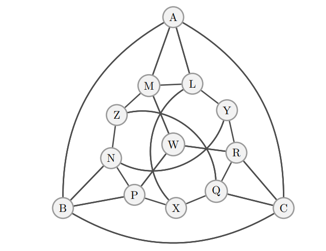

Figure 1: The graph for G13. Adding an apex vertex gives G14.

### Notation

Let a graph $G = (V, E)$ be defined by its vertices $V$ and its edges $(v_1, v_2) \in E$. If two vertices are adjacent, that they form an edge, we denote that by $v_{1} \sim v_2$.

For non-local games, each player $i$ chooses a measurement operator $\mathcal{M}_ {iq}$ that acts on their qubits upon receiving question $q \in Q$ from the referee, giving an answer $a$. The joint probability distribution for all answers is $p(a_ {1}...a_ {n}|q_ {1}...q_ {n}) = \mathrm{tr}\left[\rho \mathcal{M}_ {a|q} \right]$, where

$$\mathcal{M}_ {\mathbf{a}|\mathbf{q}} = \bigotimes_{i} \mathcal{M}_ {i,a|q},$$

and the individual (parametrized) projective measurements are

$$\mathcal{M}_ {i,a|q} = U_ {iq}^{\dagger}(\phi_ {iq})~ P_a ~U_{iq}(\phi_ {iq}),$$

which we may also denote with $\mathcal{M}_ {a_{i}|q_{i}}$ or even omit the $i$ altogether if it's obvious from context. It's worth noting the above unitary gates $U_{iq}$ applied to the projector $P_{a}=\ket{a}\bra{a}$ have the subscripts because the generators $g_{iq}$ of those unitary gates $U_{iq}=e^{-i\phi_{iq}g_{iq}}$ may also differ by player and question.

Finally, since the graph game questions are vertices $v$ and the answers are colors $c$, we may substitute $q \rightarrow v$ and $a \rightarrow c$ in this game.

### G14 Game

The objective of this non-local game is for both players, Alice and Bob, to identify a graph coloring for $G_{14}$, i.e. assigning an integer $c_i \in C$ to each vertex $v_{i}$, where no adjacent vertices may share a color. Additionally, they should strive to use as few distinct colors. The _chromatic number_ of the graph $G$ is the minimum number of colors required, $\chi(G) = |C|$.

The referee will ask one of two questions:
1. Given a vertex $q_{1} = q_{2} = v_{i} \in V$. Alice and Bob should reply with the same color $c$.
2. Given an edge $q_{1}, q_{2} = v_{i}, v_{j} \in E$. Alice and Bob should reply with different colors $c_{1} \neq c_{2}$.

Alice and Bob require $\mathrm{ceil}\left(\mathrm{log}_ {2}~\chi_q \right)$ qubits each to represent a color. The states of their system (which resides in composite space $\mathcal{H} = \mathcal{H}_ {1} \otimes \mathcal{H}_ {2}$) can be expressed in terms of the color basis vectors $\ket{c_{1}}, \ket{c_{2}}$, and we can write a general pure state as 

$$\ket{\psi} = \sum\limits_{c_ {1}, c_ {2}=1}^{\chi} a(c_ {1},c_ {2})\ket{c_ {1}c_ {2}},$$

where $c_{1}$ is Alice's color, and $c_{2}$ is Bob's color for some normalized coefficients $a(c_{1}, c_{2})$.

#### Violation Hamiltonian

In order to perform Dual-Phase Optimization (DPO) on this game, we need to construct a parametrized hamiltonian. We'll do this by creating terms that correspond to rules that should not be broken, and any quantum state that does not violate the rules will have the lowest energy. Consequently because it follows all the rules, it should solve the game.

The first set of violation terms **(#1)** will capture the players responding with different colors when given the same vertex. We wish to minimize the probability

```math
\begin{align}
p(c_{1}\neq c_{2}|v) &= \mathrm{tr}\left[\rho~ \mathcal{M}_{c_{1}\neq c_{2}|v} \right] \\
&= \sum\limits_{c_{1} \neq c_{2}} \mathrm{tr} \left[\rho~ \mathcal{M}_{c_{1}|v} \mathcal{M}_{c_{2}|v} \right] \\
&= \sum\limits_{c_{1} \neq c_{2}} \mathrm{tr} \left[\rho~ \mathcal{M}_{\mathbf{c}|v} \right]
\end{align}
```

This suggests a first term of

$$H_{v} = \sum\limits_{v \in V} \sum\limits_{c_{1}\neq c_{2}} \mathcal{M}_{\mathbf{c}|v}.$$

We'll revisit this expression later.

The second set of violation terms **(#2)** happens when the players respond with the same color for different vertices $v_{i} \sim v_{j}$. The corresponding probability to minimize is

```math
\begin{align}
p(c_{1}=c_{2}|e = v_{1}, v_{2}) &= \mathrm{tr}\left[\rho~ \mathcal{M}_{c_{1}=c_{2}|e} \right] \\
&= \sum\limits_{c} \mathrm{tr}\left[\rho~ \mathcal{M}_{c|e} \right].
\end{align}
```

This gives another operator

```math
\begin{align}
H_{e} &= \sum\limits_{e \in E}\sum\limits_{c} \mathcal{M}_ {c|e} \\
&= \sum\limits_{v_{1},v_{2} \in E} \sum\limits_{c}\mathcal{M}_ {c|v_{1}} \mathcal{M}_ {c|v_{2}} \\
&= \sum\limits_{v_{1},v_{2}\in E}\sum\limits_{c} \left(U_{v_{1}}^{\dagger}~\ket{c}\bra{c} ~U_{v_{1}} \right) \otimes \left(U_{v_{2}}^{\dagger}~\ket{c}\bra{c} ~U_{v_{2}} \right) \\
&= \sum\limits_{e \in E}\sum\limits_{c} U_{e}^{\dagger}~\ket{cc}\bra{cc}~U_{e} \\
&= \sum\limits_{e \in E} U_{e}^{\dagger} P_{cc} U_{e},
\end{align}
```

where $P_{cc}=\sum\limits_{c}\ket{cc}\bra{cc}$ is the projector onto the subspace of equal colors and $U_ {e}=U_{v_ {1}}(\phi_{1,v_ {1}}) \otimes U_{v_ {2}}(\phi_{2,v_ {2}})$ is the combined unitary applied by both players conditioned on edge $e = v_{1},v_{2}$. By rewriting $H_{v}$ as $1 - p(c_{1} = c_{2}|v)$ and using the color projector, we obtain

```math
\begin{align}
H_{v} &= \sum\limits_{v \in V} U_{v}^{\dagger}(I-P_{cc})U_{v} \\
&= |V| - \sum\limits_{v \in V} U_{v}^{\dagger}P_{cc}U_{v},
\end{align}
```

where $U_ {v} = U_ {v}(\phi_ {1,v}) \otimes U_ {v}(\phi_ {2,v})$ is again the combined unitary for both players, conditioned on the vertex $v$. These two terms give a full Hamiltonian

```math
\begin{align}
H(\phi) &= H_{v} + H_{e} \\
&= |V| - \sum\limits_{v \in V} U_{v}^{\dagger}P_{cc}U_{v}~ + \sum\limits_{e \in E} U_{e}^{\dagger} P_{cc} U_{e},
\end{align}
```

which is parametrized by the unitary gates $U_ {v}(\mathbf{\phi}_ {v}), U_ {e}(\mathbf{\phi}_ {e})$.